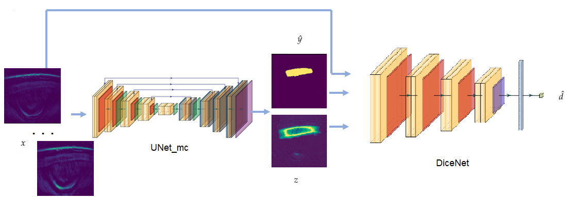

# Muscle Segmentation in MSOT images

*Abbreviations*:

*AL: Active Learning, MSOT: Multispectral Optoacoustic Tomography Images, ROI: Region of Interest, MC-dropout: Monte-Carlo dropout, CNN: Convolutional Neural Network, FCN: Fully Convolutional Network*

This project aims at the  development of an active deep learning framework for the segmentation of muscle tissue in MSOT images. MSOT is a novel imaging modality based on the optoacoustic phenomenon [1]. AL is a technique that aims at maximizing a network's performance, while at the same time minimizing the total number of annotated data needed for training the model. Thus, a close-to-the-full-data performance can be achieved by using just a subset of the data that the algorithm would usually need to train on to reach a baseline, reducing significantly the total time needed for training and alleviating the burden of large data annotation from the side of the clinicians.

In our case, the baseline behavior was established on a UNET architecture, slightly altered by introducing batch normalization layers first, and by subsequently adding dropout layers to incorporate Uncertainty Estimation. Therefore, the technique of Monte Carlo dropout was used. MC-dropout approximates a Bayesian Neural Network by sampling from a neural network trained with dropout at inference time in order to produce a distribution over the outputs. Its mathematical formulation suggests that an uncertainty map can be generated by sampling T times from the network at test time and by then computing the entropy across all classes.[2]

The dataset is split into training, validation and test set, like in every traditional deep learning algorithm. A further split of the training set into annotated- and unannotated pool with a 10-90% ratio sets the initial samples for the AL framework. In our approach, all data were annotated in advance by a clinician, however, when we refer to the *'unannotated set'* we will assume that their respective ground truths are still unknown to the model. The proposed network pipeline will be trained on the annotated data and evaluated on the unannotated data in an iterative scheme, whose goal is to yield at the end of every iteration the k most informative samples to be annotated (or in our case to be chosen with their respective ROIs) and added to the training set for the next iteration. In our approach, steps of 10% were followed until reaching the 50% of the training data. 

The proposed framework consists of the following network components: Initially a variation of UNET with MC-dropout layers (p=0.5) is responsible for producing: a segmentation mask and an uncertainty mapping. Subsequently, a second CNN was implemented, aiming at predicting a quality estimate of the model by being evaluated on the remaining unannotated data and predicting their dice coefficients. The selection of the next to-be-annotated samples is based on this dice score estimation, namely the data samples corresponding to the worst dice indices are selected and added to the training set together with their respective ROIs. Based on their role, the network components were named: UNet_mc and DiceNet respectively. The end-to-end  AL pipeline is depicted on Fig1.

The input vector denoted as x consists of one stack of 28 channels of 2D MSOT scans, each channel of which corresponds to monochromatic absorption at a particular wavelength. The machine illuminates and detects signal at 28 distinct wavelengths, starting from 700nm and reaching up to 970nm, with a 10nm step. The two outputs of the UNet_mc are referred to as y_hat: segmentation output and z: uncertainty map, while the quality estimate computed by DiceNet is called d_hat.

**Metrics**:

The Dice Coefficient metric is being used for evaluation of UNET.

**Results**:

**Literature**:

[1]: ithera-medical.com

[2]: T. DeVries and G. W. Taylor. Leveraging Uncertainty Estimates for Predicting Segmentation Quality

[3]: A. Karlas et al. Cardiovascular optoacoustics: From mice to men – A review

[4]: Yang et al. Suggestive Annotation: A Deep Active LearningFramework for Biomedical Image Segmentation

[5]: Ronneberger el al. U-Net: Convolutional Networks for Biomedical Image Segmentation

[6]: Kendall et al. What Uncertainties Do We Need in Bayesian Deep Learning for Computer Vision?
